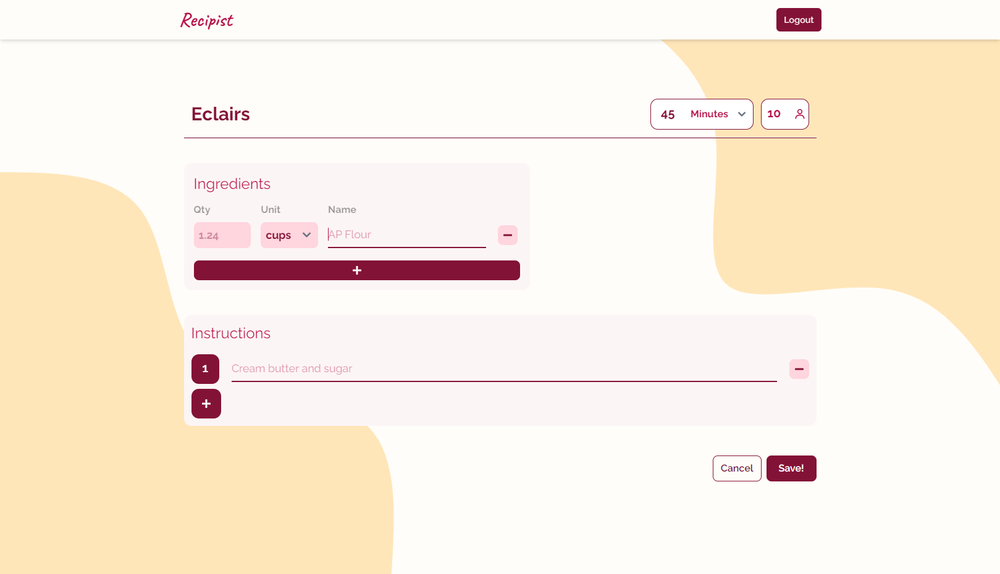

<!-- PROJECT LOGO -->
 

  

  <h3 align="center">Recipist</h3>

  

    Create. Save. Cook.
     
    <a href="https://github.com/othneildrew/Best-README-Template"><strong>Explore the docs »</strong></a>
     
     
    <a href="https://recipist.vercel.app">View Demo</a>
    ·
    <a href="https://github.com/SaifeldeenAdel/recipist/issues">Report Bug</a>
    ·
    <a href="https://github.com/SaifeldeenAdel/recipist/issues">Request Feature</a>
  

<!-- TABLE OF CONTENTS -->

  
Table of Contents

  <ol>
    <li>
      <a href="#about-the-project">About The Project</a>
      <ul>
        <li><a href="#built-with">Built With</a></li>
      </ul>
    </li>
    <li><a href="#usage">Usage</a></li>
    <li><a href="#features-to-be-added">Features to be Added</a></li>
    <li><a href="#license">License</a></li>
    <li><a href="#contact">Contact</a></li>
  </ol>

<!-- ABOUT THE PROJECT -->

## About The Project

[![Home Page screenshot][product-screenshot]](https://recipist.vercel.app)

If you're a foodie who likes to tweak recipes or even write them from scratch, this is the site for you! In Recipist, you can create and save your own recipes so you can have them all in one place and view them whenever you like.

(<a href="#readme-top">back to top</a>)

### Built With

This project was built primarily using these frameworks. Tailwindcss for the styling, Supabase for the database and authentication.

-   [![Next][Next.js]][Next-url]
-   [![React][React.js]][React-url]
-   [![TailwindCSS][Tailwind]][Tailwind-url]
-   [![Supabase][Supabase]][Supabase-url]

(<a href="#readme-top">back to top</a>)

### Usage

With its clean and minimal UI, users can:

-   Login using a Magic Link - utilising Supabase Auth
-   View their recipe collection

    

-   Add new recipes to their collection

    

-   View a recipe on its own

    

-   Edit older recipes to update ingredients, instructions, etc.

(<a href="#readme-top">back to top</a>)

## Features to be added

-   [ ] Allow users to add recipe to "Favourites"
-   [ ] Sorting the list of recipes (A-Z, time taken, etc)
-   [ ] Rearranging ingredients instead of deleting and re-adding

See the [open issues](https://github.com/SaifeldeenAdel/recipist/issues) for a full list of proposed features (and known issues).

(<a href="#readme-top">back to top</a>)

<!-- LICENSE -->

## License

Distributed under the MIT License. See `LICENSE.txt` for more information.

(<a href="#readme-top">back to top</a>)

<!-- CONTACT -->

## Contact

Saif eldeen Adel - [Portfolio](https://saifdev.vercel.app)

Project Link: [https://github.com/SaifeldeenAdel/recipist](https://github.com/SaifeldeenAdel/recipist)

(<a href="#readme-top">back to top</a>)

[linkedin-url]: https://linkedin.com/in/othneildrew
[product-screenshot]: public/Login.png
[Next.js]: https://img.shields.io/badge/next.js-000000?style=for-the-badge&logo=nextdotjs&logoColor=white
[Next-url]: https://nextjs.org/
[React.js]: https://img.shields.io/badge/React-20232A?style=for-the-badge&logo=react&logoColor=61DAFB
[React-url]: https://reactjs.org/
[Tailwind]: https://img.shields.io/badge/Tailwind_CSS-38B2AC?style=for-the-badge&logo=tailwind-css&logoColor=white
[Tailwind-url]: https://tailwindcss.com/
[Supabase]: https://img.shields.io/badge/Supabase-181818?style=for-the-badge&logo=supabase&logoColor=white
[Supabase-url]: https://supabase.com/
